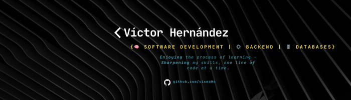

<h2 align="center">Hi 👋! My name is Victor and I'm a Developer, from Colombia.</h2>

###

  

###

<h2 align="left">💫 About Me:</h2>

###

I am a Systems Engineering student with a strong passion for backend development and software architecture. I have experience working with Django REST Framework, Spring Boot, microservices, Docker, and SQL databases. I am deeply motivated by continuous learning, always exploring new technologies and looking for ways to improve my skills as a developer.

###

<h2 align="left">💻 Tech Stack:</h2>

###
                          

###

<h2 align="left">🚀 Projects:</h2>

   
  
    
  
  

###

<h2 align="left">📊 GitHub Stats:</h2>

###

  
  
  

###

<h2 align="left">🌐 Socials:</h2>

###

  
  

###

## 🧠 Currently Learning

- Backend development with microservices using **Spring Boot**
- Security best practices in **Spring Boot**
- Frontend development with **Angular**

###

 

<!-- <picture>
  <source media="(prefers-color-scheme: dark)" srcset="https://raw.githubusercontent.com/vicmaHo/vicmaHo/output/github-snake-dark.svg" />
  <source media="(prefers-color-scheme: light)" srcset="https://raw.githubusercontent.com/vicmaHo/vicmaHo/output/github-snake.svg" />
  
</picture> -->
###

<!---
vicmaHo/vicmaHo is a ✨ special ✨ repository because its `README.md` (this file) appears on your GitHub profile.
You can click the Preview link to take a look at your changes.
--->
